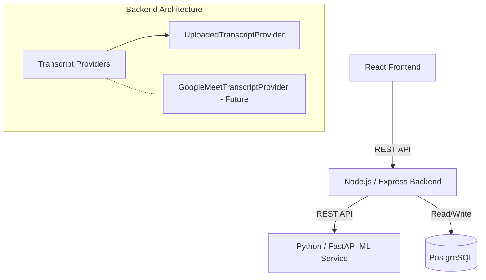

# MeetMind — AI Meeting Intelligence & Action Extractor

MeetMind is a full-stack academic NLP project that analyzes meeting transcripts to automatically extract action items, decisions, deadlines, key topics, and participants.

## Architecture



## Features
- **NLP Pipeline**: Preprocessing, sentence segmentation, Zero-shot classification (HuggingFace Transformers), and Entity Extraction (spaCy).
- **Extraction**: Identifies ACTION_ITEM, DECISION, DEADLINE, and DISCUSSION points with confidence scores.
- **Frontend Dashboard**: Built with React, Vite, Tailwind CSS, and Recharts.
- **Extensible Architecture**: Abstract `TranscriptProvider` allows seamless future integration with Google Meet or Zoom.

## Setup Instructions

### 1. Database (PostgreSQL)
Since you have PostgreSQL installed locally, you do not need Docker. We have already initialized the database for you. 
If you ever need to reset it, you can run this command from the project root:
```bash
psql -U postgres -d meetmind -f database/schema.sql
```
*(Make sure your local PostgreSQL is running on the default port 5432. Update the `.env` file in the `backend/` folder if your postgres user has a specific password).*

### 2. ML Service (Python / FastAPI)
The ML service uses PyTorch, Transformers, and spaCy.
```bash
cd ml-service
# Create a virtual environment
python -m venv venv
# Activate it
# On Windows: venv\Scripts\activate
# On Mac/Linux: source venv/bin/activate

pip install -r requirements.txt
python -m spacy download en_core_web_sm

# Start the service
uvicorn app.main:app --reload --port 8000
```
*The NLP service will be available at `http://localhost:8000`.*

### 3. Backend Service (Node.js)
```bash
cd backend
npm install
npm run dev
```
*The backend API will run on `http://localhost:3000`.*

### 4. Frontend Application (React)
```bash
cd frontend
npm install
npm run dev
```
*The React UI will run on `http://localhost:5173`.*

## Example API Request

**POST** `/api/meetings/analyze`
```json
{
  "title": "Weekly Sync",
  "transcript": "Let's decide on the framework. We decided to use React. Bob will implement the UI by Friday."
}
```

**Response:**
```json
{
  "meetingId": 1,
  "message": "Meeting analyzed and saved successfully.",
  "data": {
    "actionItems": [
      {
        "type": "ACTION_ITEM",
        "person": "Bob",
        "task": "Bob will implement the UI by Friday.",
        "deadline": "Friday",
        "confidence": 0.94
      }
    ],
    "decisions": [
      {
        "type": "DECISION",
        "decision": "We decided to use React.",
        "confidence": 0.88
      }
    ],
    ...
  }
}
```

## Future Extensions
- **Fine-Tuning**: A `train.py` template is provided in `ml-service/` for fine-tuning a DistilBERT model on annotated data.
- **Google Meet Integration**: Implement the `GoogleMeetTranscriptProvider` interface in the Node.js backend.
